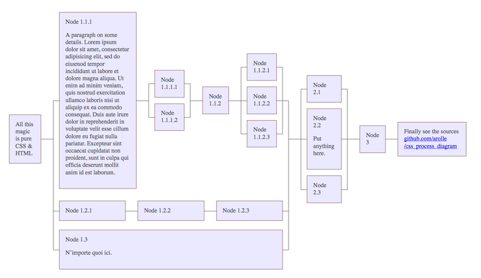

# A Process Diagram with pure CSS & HTML

This gives a basic styling for a diagram of processes. It’s a proof-of-concept of what can be realised just with CSS & HTML.

To get a clue of the semantics, read further and take a look into the [`index.html`](http://github.com/arolle/css_process_diagram/index.html) source.

Tested to work with Chrome 24, Firefox 16 and Opera 12 and above.

---

Each node in the graph is wrapped into a `div` tag, as follows:

	

		<!-- some node’s content here -->
	

If there are two or more items that should be displayed parallel in the graph these shall be put inside a `ul`-list. For parallel process-lines the ordering is unimportant. Thats why to take a `ul` in that case.

	<ul>
		<li><!-- containing either ol, ul or div --></li>
		<li><!-- containing either ol, ul or div --></li>
		<!-- eventually more -->
	</ul>

As third type for structuring we have `ol`s. These will be displayed one after another. So ordering is important.

	<ol>
		<li><!-- containing either ol, ul or div --></li>
		<!-- eventually more -->
	</ol>

The Graph should always be wrapped in a `ol` with class `process_diagram`:

	<ol class="process_diagram">
		<li><!-- containing either ol, ul or div --></li>
		<!-- eventually more -->
	</ol>